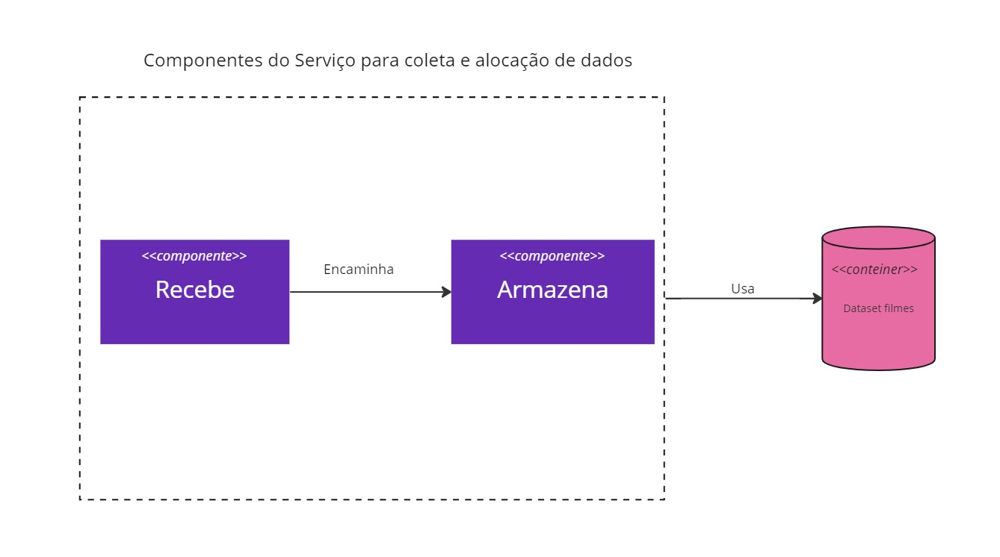

## Diagramas de Componentes
<b>Componentes do Serviço para coleta e alocação de dados do Scraper de Redes Sociais.</b>

<b>Componentes do Serviço de refinamento dos dados coletados pelo Scraper de Redes Sociais. Esse dados serão utilizados para treinamento da Inteligência Artificial.</b>

<b> Limpeza de Dados:</b> deve buscar por dados que contenham pelo menos 1 filme, informação de perfil demográfico e a qualificação sobre o(s) filme(s). Na ausência de alguma dessas informações será feito o descarte.

<b>Categoriza: </b> deve catalogar os dados para serem armazenados. 

<b>Componentes do Serviço para coleta e alocação de dados da plataforma de avaliações e críticas de filmes. </b>

