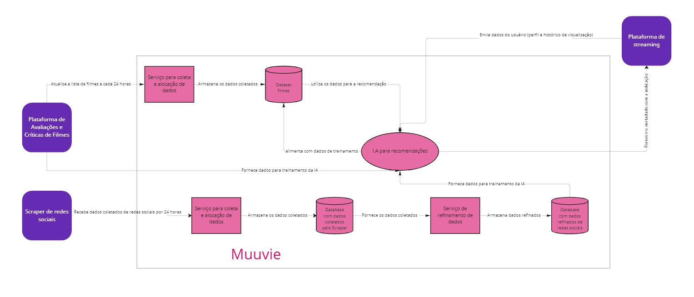

## Diagrama de Contêiner
Agrupamento dos componentes do sistema em contêiners, detalhando de maneira macro o sistema de software, exibindo as várias partes do mesmo e mostrando as decisões de tecnologias decididas.
Estruturada para funcionar de forma indepente da Plataforma de Streaming, que contratará o serviços da Muuvie, Scraper de Redes Socias, coletando informações de qualquer rede social, assim como das plataformas de Avaliações e Críticas.
