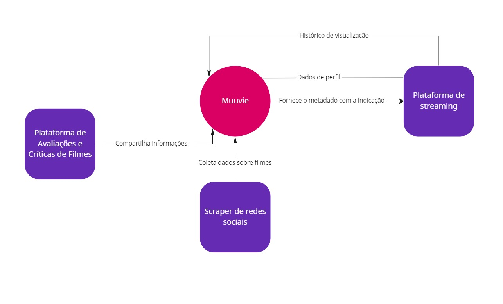
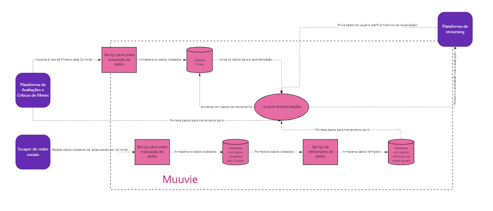
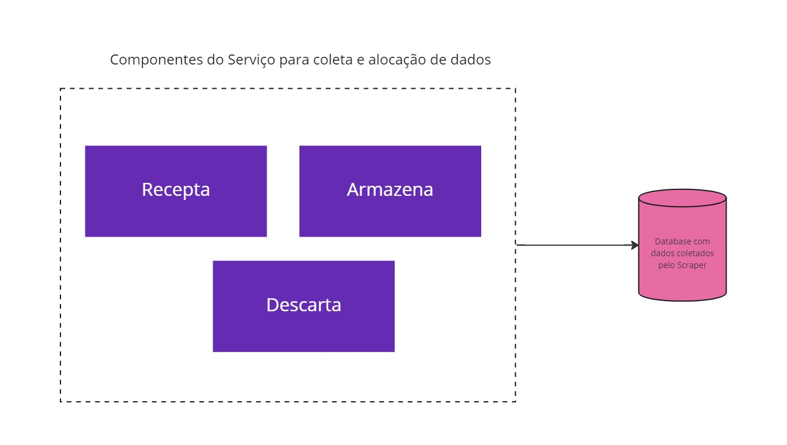
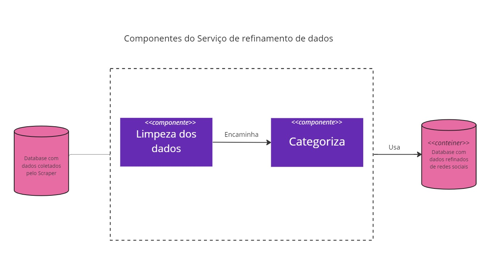

# muuvie
Repositório criado para acompanhamento da disciplina de Design de Software, ministrada pelo professor <i>Fabio Lucena</i>.

 <b>Descrição</b> 
O objetivo deste projeto e o desenvolvimento de um aplicativo que indica filmes para o usuário, baseando-se em dados fornecidos pelos mesmos, informando a plataforma onde esse filme pode está disponível. Além disso, o aplicativo terá um registro de filmes já assistidos por meio de um sistema de avaliação.
 

## muuvie - Seu filme em alguns muu's
Quem nunca se sentou na sala ou se deitou na cama e foi colocar um filme para assistir e se perguntou: _Qual o filme vou assistir hoje?_ E a partir desse momento você fica minutos, dependendo até horas passando por um catálogo até decidir o que assistir.

A ideia do nosso projeto é criar um sistema onde as pessoas tenham indicações de filmes para assistir baseado em algumas categorias pré-selecionadas que irá capturar a essência da pessoa e apontar exatamente o que ela quer assistir hoje.

Com uma interface simples e intuitiva, em pouco minutos a pessoa terá o filme para assistir e ainda a possibilidade de avaliar se gostou ou não da sugestão, evitando assim ficar por horas procurando o filme ideal para assistir.

Protótipo: [Link de acesso ao figma](https://www.figma.com/proto/3BouSZzPDmVwEkjrNSf8zA/app-muuvie?node-id=344%3A6533&starting-point-node-id=344%3A6533)
 

## Discentes
- Bruna Do Espirito Santo Sousa - Matrícula 202107999 
- Joyce Beatriz Ferreira Da Costa Silva - Matrícula 201910890 
- Layane Grazielle Souza Dias - Matrícula 202004763 
- Pedro Ivo Santana Melo - Matrícula 202004776 
- Pedro Paulo Oliveira Lopes - Matrícula 201905548

## Diagrama de contexto
ESCREVE AQ PEDRO: Modelagem do escopo de forma gráfica. Descreve as movimentações de dados e interações entre as interfaces do sistema.

## Diagrama de Contêiner

## Diagramas de Componentes

Componentes do Serviço para coleta e alocação de dados do Scraper de Redes Sociais.

Componentes do Serviço de definamento dos dados coletados pelo Scraper de Redes Sociais. Esse dados serão utilizados para treinamento da Inteligência Artificial.

<b> Limpeza de Dados:</b> deve buscar por dados que contenham pelo menos 1 filme, informação de perfil demográfico e a qualificação sobre o(s) filme(s). Na ausência de alguma dessas informações será feito o descarte.

<b>Categoriza: </b> deve catalogar os dados para serem armazenados. 

Componentes do Serviço para coleta e alocação de dados da plataforma de avaliações e críticas de filmes.

